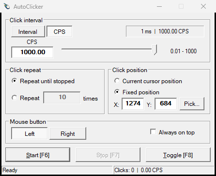

<p align="center">
  
</p>

<h1 align="center">AutoClicker</h1>

<p align="center">
  A compact, native auto-clicker for Windows with a classic desktop interface.
</p>



AutoClicker provides precise interval and CPS controls without a GUI framework or bundled runtime
DLLs. It is implemented in C++20 using the Win32 API and ships as a single executable.

Published builds are available from the repository's GitHub Releases page. Each release includes
`AutoClicker.exe` and a `SHA256SUMS.txt` checksum.

## Highlights

- Direct interval input in hours, minutes, seconds, and milliseconds
- Logarithmic control from `0.01` to `1000` clicks per second
- Unlimited or fixed repeat counts
- Current-cursor and fixed-position modes
- Interactive position picker with right-click cancellation
- Left and right mouse button support
- Live successful-click count and measured CPS
- High-resolution waitable timer with a compatibility fallback
- Automatically saved per-user settings
- Optional always-on-top mode

## Usage

1. Enter an interval, or enable CPS mode and adjust the slider.
2. Select unlimited clicking or enter a repeat count.
3. Use the current cursor, enter fixed coordinates, or select `Pick...` and left-click a target.
4. Choose the left or right mouse button.
5. Start from the window or with `F6`.

| Key | Action |
| --- | --- |
| `F6` | Start |
| `F7` | Stop or cancel position picking |
| `F8` | Toggle start/stop |

The picker hides the window and suppresses the click used to select the target. Right-click or `F7`
cancels without changing the saved position.

The live CPS value reports successful click submissions by AutoClicker. Windows scheduling and the
target application can limit the effective rate, especially at very high CPS values.

## Build from source

You need Windows, CMake 3.21 or newer, and either Visual Studio 2022 with the C++ tools or a
MinGW-w64 C++20 toolchain.

### Visual Studio / MSVC

```powershell
cmake -S . -B build -A x64
cmake --build build --config Release --parallel
```

The executable is created at `build/Release/AutoClicker.exe`.

### MinGW-w64 with Ninja

```powershell
cmake -S . -B build -G Ninja -DCMAKE_BUILD_TYPE=Release
cmake --build build --parallel
```

The executable is created at `build/AutoClicker.exe`. Both supported toolchains produce a
self-contained executable with statically linked C/C++ runtimes.

To stage a local copy in the ignored `release` directory, run:

```powershell
cmake --install build --config Release --prefix release
```

GitHub Actions verifies the MSVC x64 Release build for every push and pull request. CI builds are
not published for download.

## Publishing a release

Push a version tag to build and publish that exact revision on the GitHub Releases page:

```powershell
git tag v2.1.0
git push origin v2.1.0
```

Release tags must begin with `v`. Before publishing, configure a GitHub environment named `release`
with a required reviewer so the publishing job waits for explicit approval.

## Settings

AutoClicker stores settings for the current Windows user under:

```text
HKEY_CURRENT_USER\Software\AutoClicker
```

Deleting that registry key restores the defaults the next time the application starts.
